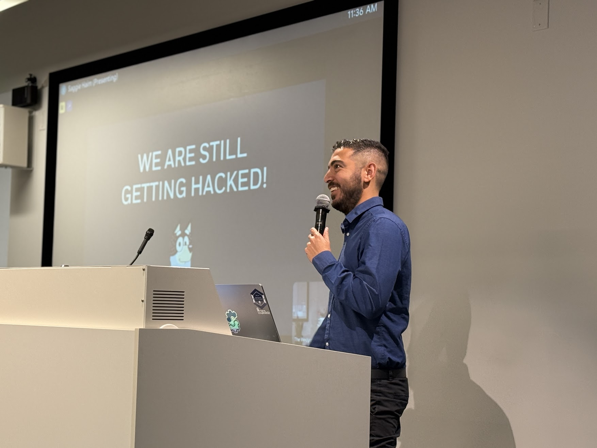

+++
title = "About"
date = "2024-07-08"
aliases = ["about-us", "about-saggie", "contact"]
author = "Saggie Haim"
toc = false
+++



Hi, I am Saggie, a cloud and AI security architect, blogger, and trainer. I help large international enterprises design modern SOC architectures and move to the cloud securely and in line with compliance.

Today I am a Cloud Solution Architect at Microsoft. I lead demos and proofs of concept for Microsoft Security, help customers adopt Defender for Cloud and Sentinel, and drive Security for AI practices with practical presentations and solutions.

Previously I led cloud security programs at CyberProof, partnering with some of the biggest enterprises in the world. I built flexible log collection and automation for Azure Sentinel, improved delivery with infrastructure as code, and created repeatable playbooks that teams could run with confidence.

I enjoy troubleshooting and teaching. I write a lot of PowerShell, refine detections, and focus on results that stick.

This blog shares lessons from real projects across cloud security, AI security, Sentinel, and automation.

Hope you enjoy my blogging! Feel free to [Contact me](/contact)
