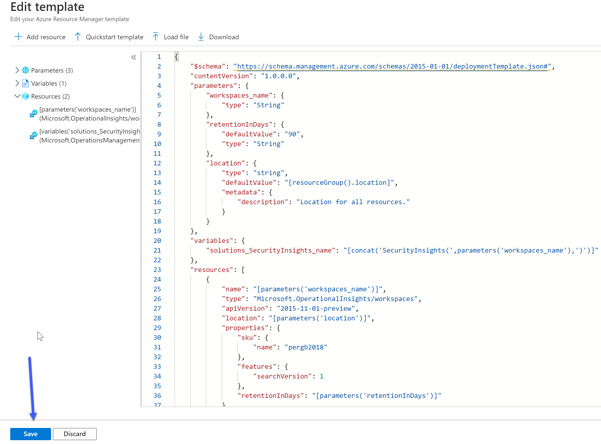
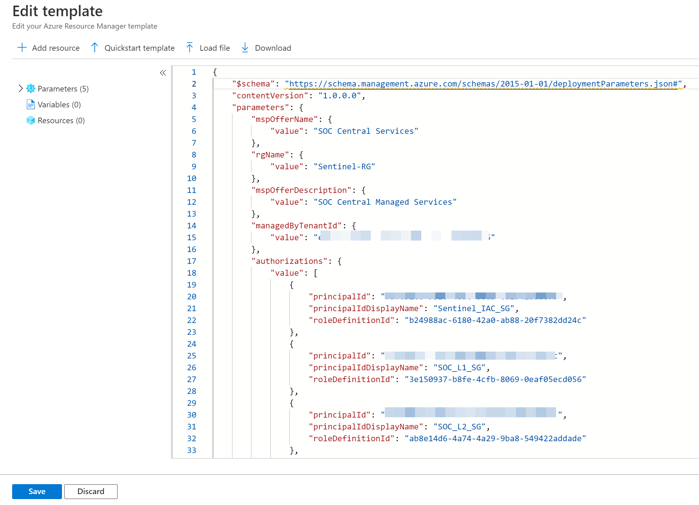
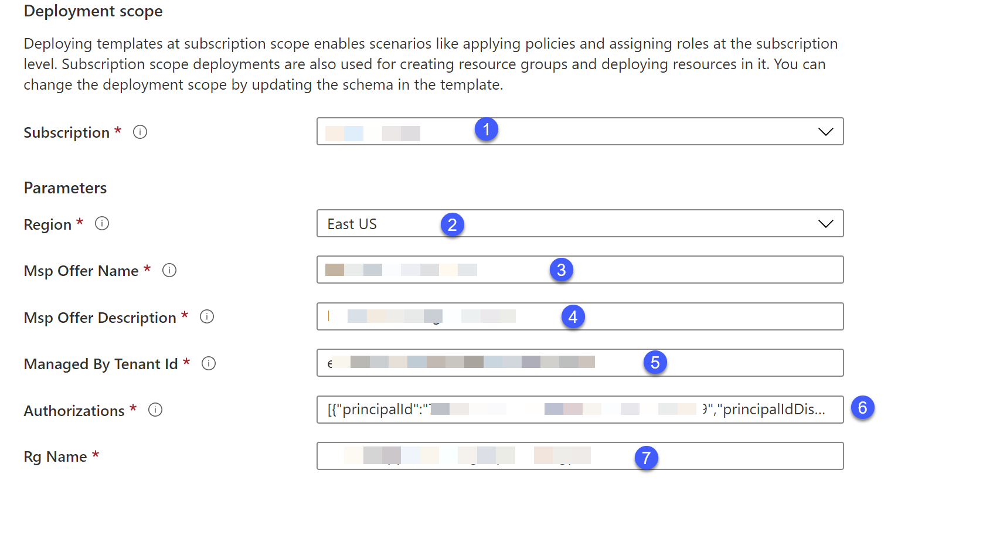

+++
author = "Saggie Haim"
title = "Deploy Azure Sentinel to a multi-tenancy environment"
date = "2020-10-14"
description = "Azure Sentinel is a scalable, cloud-native, SIEM and SOAR solution. The challenge begins when you have a multi-tenancy environment to monitor. Learn how Azure Lighthouse enables cross- and multi-tenant management, automation, and scalability."
toc = true
image = "/images/AzureLighthouse.png"
tags = [
    "Microsoft Sentinel",
    "PowerShell",
    "Azure",
]
categories = [
    "Cloud Security",
    "Microsoft Sentinel",
]
keywords = [
    "Deploy Azure Sentinel",
    "Azure Sentinel multi-tenancy",
    "Multi-tenant Azure Sentinel",
    "Azure Sentinel deployment",
    "PowerShell Azure Sentinel",
    "Cloud security monitoring",
    "Azure multi-tenancy setup",
    "Automate Azure Sentinel",
    "IT security automation",
    "Azure Sentinel tutorial",
    "Multi-tenancy security",
    "Azure security tools",
    "Azure Sentinel best practices",
    "Multi-tenant environment",
    "Cloud security management"
]
+++

For those of you who don't know Azure Sentinel, Azure Sentinel is a scalable, cloud-native, security information event management (SIEM) and security orchestration automated response (SOAR) solution.
Azure Sentinel delivers intelligent security analytics and threat intelligence across the enterprise, providing a single solution for alert detection, threat visibility, proactive hunting, and threat response.

The challenge begins when you have a multi-tenancy environment to monitor, as you need to jump from one tenant to keep up with the incidents.
The deployment and maintenance of Azure Sentinel content are time-consuming, and you can't run cross workspace queries between tenants.

But fear not, you can use Azure Lighthouse to ease the management and operation.

## What is Azure Lighthouse

Azure Lighthouse enables cross- and multi-tenant management, allowing for higher automation, scalability, and enhanced governance across resources and tenants.

With Azure Lighthouse, you can "expose" resource groups (or subscriptions) with the resources inside, in our case Azure Sentinel and Log Analytics workspaces from all of your tenants to your central management.

There are no additional costs associated with using Azure Lighthouse to manage Azure resources, and any Azure customer or partner can use Azure Lighthouse.

Azure Lighthouse is also secured by design, as it delegating permissions to Users and/or groups from the central tenant to the resources in other tenants, which means you use the same account and can see and interact only with what exposed to you.


## Prerequisites

Before we can start, there are a few prerequisites that we need to meet:

+ This deployment must be done by a non-guest account in the customer's tenant who has the Owner built-in role for the subscription being onboarded (or which contains the resource groups that are being onboarded)
+ The tenant ID of the service provider's tenant (where you will be managing the customer's resources)
+ The tenant ID of the customer's tenant (which will have resources managed by the service provider)
+ The subscription IDs for each specific subscription in the customer's tenant that will be managed by the service provider (or that contains the resource group(s) that will be managed by the service provider).

After fulfilling those prerequisites, we can continue with our guide.

## Planning our deployment

### Permissions

When deploying Lighthouse, we are delegating permissions to our users.
planning before will save us the time later

| **Role** | **Create and Run Playbook** | **Create and edit workbooks, analytic rules, and other Azure Sentinel resources** | **Manage incidents (dismiss, assign etc.)** | **View data, incidents, dashboards and other Azure Sentinel resources** |
|:---|:---:|:---:|:---:|:---:|
| Azure Sentinel reader | -- | -- | -- | X |
| Azure Sentinel responder | -- | -- | X | X |
| Azure Sentinel contributor | -- | X | X | X |
| Azure Sentinel contributor + Logic App contributor | X | X | X | X |

#### Role Definitions

To define authorizations, you'll need to know the ID values for each user, user group, or service principal in the service provider tenant to which you want to grant access.
You'll also need the role definition ID for each built-in role you want to assign.
If you don't have them already, you can retrieve them by running the commands below from within PowerShell:

```PowerShell
Get-AzRoleDefinition | select Name, ID
```

To make it easy, here are the ID that we need:
| Role Name | Role ID |
|---|---|
| Reader | acdd72a7-3385-48ef-bd42-f606fba81ae7 |
| Azure Sentinel Reader | 8d289c81-5878-46d4-8554-54e1e3d8b5cb |
| Azure Sentinel Responder | 3e150937-b8fe-4cfb-8069-0eaf05ecd056 |
| Azure Sentinel Contributor | ab8e14d6-4a74-4a29-9ba8-549422addade |
| Logic App Contributor | 87a39d53-fc1b-424a-814c-f7e04687dc9e |
| Contributor | b24988ac-6180-42a0-ab88-20f7382dd24c |

You will use it later in this guide.

### Security Groups

To make management easier, I recommend using Azure AD security groups for each role.
This gives you the flexibility to add or remove individual users to the group that has access so that you don't have to repeat the onboarding process to make user changes.
You can assign roles to a service principal, which can be useful for automation scenarios.

I will use the following groups in this post:

| Group Name | Permissions | Description |
|---|---|---|
| Sentinel_IAC_SG | Contributor | Group that will hold the Service Account that will run the automation's |
| SOC_L1_SG | Azure Sentinel Responder | Group for the SOC L1 team, they usually the first to respond to security incidents |
| SOC_L2_SG | Azure Sentinel Contributor, Logic App Contributor | Group for the SOC L2, the security analysts. They will deal with escalations, build detection rules and more. |
| Executives_SG | Azure Sentinel Reader | Group for the executives, so they can see the security status of the organization. |

### Optional - Deploy using PowerShell

If you want to deploy the templates using PowerShell, you will first need to set up a session to Azure using PowerShell.

Here how:

#### Az Module

Azure PowerShell Az module is a PowerShell module for interacting with Azure.
Az offers shorter commands, improved stability, and cross-platform support.

To install it, you run the following command:

```PowerShell
Install-Module az -AllowClobber -Scope CurrentUser
```

#### Connect to Azure with PowerShell

You need to get your Tenant ID and Subscription ID from the Azure Portal.

With this information, you can use the `Connect-AzAccount` to create a session with Azure:

```PowerShell
$TenantID = 'XXXXXXXX-XXXX-XXXX-XXXX-XXXXXXXXXXXX'
$SubscriptionID = 'XXXXXXXX-XXXX-XXXX-XXXX-XXXXXXXXXXXX'
Connect-AzAccount -TenantId $TenantID -SubscriptionId $SubscriptionID
```

Now you can interact with Azure from PowerShell.

## Deploying Azure Log Analytics and Azure Sentinel

If you don't already have Azure Log Analytics and Azure Sentinel deployed, you will need to deploy it.

I've created an ARM Template to help you with it:

```json
{
    "$schema": "https://schema.management.azure.com/schemas/2015-01-01/deploymentTemplate.json#",
    "contentVersion": "1.0.0.0",
    "parameters": {
        "workspaces_name": {
            "type": "String"
        },
        "retentionInDays": {
            "defaultValue": "90",
            "type": "String"
        },
        "location": {
            "type": "string",
            "defaultValue": "[resourceGroup().location]",
            "metadata": {
                "description": "Location for all resources."
            }
        }
    },
    "variables": {
        "solutions_SecurityInsights_name": "[concat('SecurityInsights(',parameters('workspaces_name'),')')]"
    },
    "resources": [
        {
            "name": "[parameters('workspaces_name')]",
            "type": "Microsoft.OperationalInsights/workspaces",
            "apiVersion": "2015-11-01-preview",
            "location": "[parameters('location')]",
            "properties": {
                "sku": {
                    "name": "pergb2018"
                },
                "features": {
                    "searchVersion": 1
                },
                "retentionInDays": "[parameters('retentionInDays')]"
            }
        },
        {
            "type": "Microsoft.OperationsManagement/solutions",
            "apiVersion": "2015-11-01-preview",
            "name": "[variables('solutions_SecurityInsights_name')]",
            "location": "[parameters('location')]",
            "dependsOn": [
                "[resourceId('microsoft.operationalinsights/workspaces', parameters('workspaces_name'))]"
            ],
            "plan": {
                "name": "[variables('solutions_SecurityInsights_name')]",
                "promotionCode": "",
                "product": "OMSGallery/SecurityInsights",
                "publisher": "Microsoft"
            },
            "properties": {
                "workspaceResourceId": "[resourceId('microsoft.operationalinsights/workspaces', parameters('workspaces_name'))]",
                "containedResources": [
                ]
            }
        }
    ]
}
```

You can deploy it using either PowerShell or Azure Portal:

## Deploy Using Azure Portal

To deploy the template using Azure Portal, first navigate to [Azure Portal](portal.azure.com) and sign in.

Then on the top search bar, search for "Deploy a custom template."


On the Custom deployment page, click on **Build your own template in the editor**


Next, you will need to replace the empty template with the template I provided.
The template will add the resources we want to deploy.



Click **save** when you finished.

Last, we need to provide the info for the template.
the information we will need to provide is:

+ **Subscription** - The name of the subscription we want to deploy the resources to
+ **Resource Group** - The name of the Resources group that we want to deploy the resources to (Create new if you didn't created one)
+ **Workspaces_name** - The name of the Azure Log Analytics workspace


Click on **Review + create** to deploy the resources.

## Deploy Using PowerShell

To deploy the resources using PowerShell, make sure you first have an active session with PowerShell.

### Creating a Resource group

With the `New-AzResourceGroup` you can create a new resource group.
Inside the Resource group, we will deploy the Log Analytics Workspace and Sentinel, and this is the Resource group we will delegate.

> Every resource in Azure requires a location to be deployed to.
> The location is referring to the Datacenter region.
> In this Guide, I will use the West Europe region.

```PowerShell
New-AzResourceGroup -Name "Sentinel-RG" -Location "WestEurope"
```

> You will get asked for the Log Analytics Workspace name.

### Deploying the template

Because this is an ARM template deployment, We can
use the `New-AzResourceGroupDeployment` cmdlet.

```PowerShell
New-AzResourceGroupDeployment -ResourceGroupName "Sentinel-RG" -TemplateFile .\DeploySentinel.json
```

## Deploy Azure Lighthouse

To deploy Azure Lighthouse, navigate again to "Deploy a custom template."

On the Custom deployment page, click on **Build your own template in the editor.**

Next, you will need to replace the empty template, but this time with the following:

```json
{
    "$schema": "https://schema.management.azure.com/schemas/2018-05-01/subscriptionDeploymentTemplate.json#",
    "contentVersion": "1.0.0.0",
    "parameters": {
        "mspOfferName": {
            "type": "string",
            "metadata": {
                "description": "Specify the name of the offer from the Managed Service Provider"
            }
        },
        "mspOfferDescription": {
            "type": "string",
            "metadata": {
                "description": "Name of the Managed Service Provider offering"
            }
        },
        "managedByTenantId": {
            "type": "string",
            "metadata": {
                "description": "Specify the tenant id of the Managed Service Provider"
            }
        },
        "authorizations": {
            "type": "array",
            "metadata": {
                "description": "Specify an array of objects, containing tuples of Azure Active Directory principalId, a Azure roleDefinitionId, and an optional principalIdDisplayName. The roleDefinition specified is granted to the principalId in the provider's Active Directory and the principalIdDisplayName is visible to customers."
            }
        },
        "rgName": {
            "type": "string"
        }
    },
    "variables": {
        "mspRegistrationName": "[guid(parameters('mspOfferName'))]",
        "mspAssignmentName": "[guid(parameters('rgName'))]"
    },
    "resources": [
        {
            "type": "Microsoft.ManagedServices/registrationDefinitions",
            "apiVersion": "2019-06-01",
            "name": "[variables('mspRegistrationName')]",
            "properties": {
                "registrationDefinitionName": "[parameters('mspOfferName')]",
                "description": "[parameters('mspOfferDescription')]",
                "managedByTenantId": "[parameters('managedByTenantId')]",
                "authorizations": "[parameters('authorizations')]"
            }
        },
        {
            "type": "Microsoft.Resources/deployments",
            "apiVersion": "2018-05-01",
            "name": "rgAssignment",
            "resourceGroup": "[parameters('rgName')]",
            "dependsOn": [
                "[resourceId('Microsoft.ManagedServices/registrationDefinitions/', variables('mspRegistrationName'))]"
            ],
            "properties":{
                "mode":"Incremental",
                "template":{
                    "$schema": "https://schema.management.azure.com/schemas/2015-01-01/deploymentTemplate.json#",
                    "contentVersion": "1.0.0.0",
                    "parameters": {},
                    "resources": [
                        {
                            "type": "Microsoft.ManagedServices/registrationAssignments",
                            "apiVersion": "2019-06-01",
                            "name": "[variables('mspAssignmentName')]",
                            "properties": {
                                "registrationDefinitionId": "[resourceId('Microsoft.ManagedServices/registrationDefinitions/', variables('mspRegistrationName'))]"
                            }
                        }
                    ]
                }
            }
        }
    ],
    "outputs": {
        "mspOfferName": {
            "type": "string",
            "value": "[concat('Managed by', ' ', parameters('mspOfferName'))]"
        },
        "authorizations": {
            "type": "array",
            "value": "[parameters('authorizations')]"
        }
    }
}
```

click on **save** when you finished.

On the next page, it will ask you to fill in the parameters. Click on **Edit parameters**.


in this screen, you will need to copy the following JSON file:

```json
{
    "$schema": "https://schema.management.azure.com/schemas/2015-01-01/deploymentParameters.json#",
    "contentVersion": "1.0.0.0",
    "parameters": {
        "mspOfferName": {
            "value": "SOC Central Services"
        },
        "rgName": {
            "value": "Sentinel-RG"
        },
        "mspOfferDescription": {
            "value": "SOC Central Managed Services"
        },
        "managedByTenantId": {
            "value": "XXXXXXXX-XXXX-XXXX-XXXX-XXXXXXXXXXXX"
        },
        "authorizations": {
            "value": [
                {
                    "principalId": "XXXXXXXX-XXXX-XXXX-XXXX-XXXXXXXXXXXX",
                    "principalIdDisplayName": "Sentinel_IAC_SG",
                    "roleDefinitionId": "b24988ac-6180-42a0-ab88-20f7382dd24c"
                },
                {
                    "principalId": "XXXXXXXX-XXXX-XXXX-XXXX-XXXXXXXXXXXX",
                    "principalIdDisplayName": "SOC_L1_SG",
                    "roleDefinitionId": "3e150937-b8fe-4cfb-8069-0eaf05ecd056"
                },
                {
                    "principalId": "XXXXXXXX-XXXX-XXXX-XXXX-XXXXXXXXXXXX",
                    "principalIdDisplayName": "SOC_L2_SG",
                    "roleDefinitionId": "ab8e14d6-4a74-4a29-9ba8-549422addade"
                },
                {
                    "principalId": "XXXXXXXX-XXXX-XXXX-XXXX-XXXXXXXXXXXX",
                    "principalIdDisplayName": "SOC_L2_SG",
                    "roleDefinitionId": "87a39d53-fc1b-424a-814c-f7e04687dc9e"
                },
                {
                    "principalId": "XXXXXXXX-XXXX-XXXX-XXXX-XXXXXXXXXXXX",
                    "principalIdDisplayName": "Executives_SG",
                    "roleDefinitionId": "acdd72a7-3385-48ef-bd42-f606fba81ae7"
                }

            ]
        }
    }
}
```



Click **Save** when you finish copying the script.

You'll be sent back to the previous page, but this time, you will have all the parameters filled in from the template lets have a quick overview, so you will understand what you are deploying:



+ **Subscription**: The Subscription where we deployed our Log Analytics and Sentinel.
+ **Region**: The Region where we deployed our Log Analytics and Sentinel
+ **Msp Offer Name**: The name of the Managed service provider name, you will use it later, choose a good name
+ **Msp Offer Description**: The description of the Managed service provider
+ **Managed By Tenant Id**: The Tenant Id you delegate permissions to.
+ **Authorizations**: The Identities from the Managed services Tenant, and the RBAC roles they will get.
+ **Resource Group**: The name of the Resource Group we want to delegate permissions to.

Now, you can press on **Review + Create** button.
If all validations pass, you'll be able to deploy the template and successfully onboard your resource group.


## Deploy Using PowerShell

This time we will have also provide the TemplateParameterFile.
We use the same `New-AzResourceGroupDeployment` cmdlet.

```PowerShell
New-AzResourceGroupDeployment -ResourceGroupName "Sentinel-RG" -TemplateFile .\rgDelegatedResourceManagement.json -TemplateParameterFile .\rgDelegatedResourceManagement.parameters.json
```

>**MAKE SURE YOU ARE CONNECTED TO THE RELEVANT TENANT AND SUBSCRIPTION BEFORE DEPLOYMENT!**

## Verify your deployment

To verify you deployed everything as expected, you have a few things you can do.
>It can take up to 10 mins after the deployment completed to see the changes

### From the manged tenant

From the manged tenant, you can navigate to **Service providers**.
In the **Service providers**, you can navigate to **Delegations** and see all the delegations in your tenant.

### From the central tenant

From the central tenant, you can navigate to **My Customers**.
In the **My Customers** page, you can navigate to **Delegations** or **Customers** and see all the delegations in your tenant.

## Summary

Azure Lighthouse ease the management of a multi-tenancy environment, and with Microsoft adding a lot of new features for Multiple Azure Sentinel workspaces, Azure Lighthouse is a must.

After reading this post, you will know more about Azure Lighthouse and the benefit of using it.
You will know how to plan a successful deployment and, of course, how to deploy it.
