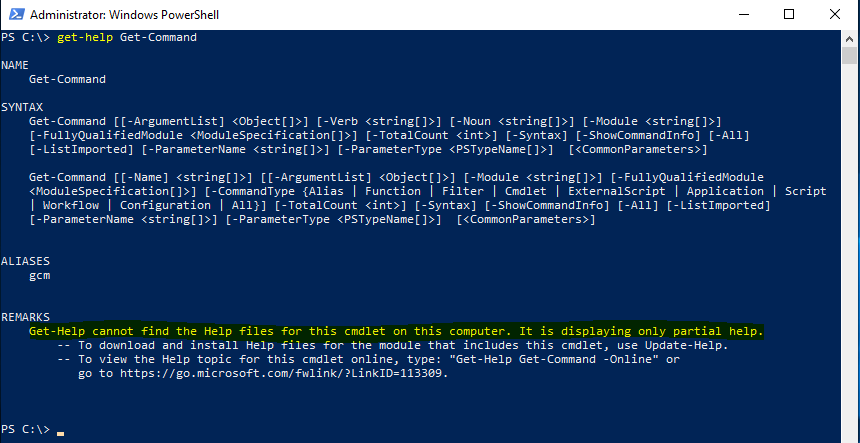

+++
author = "Saggie Haim"
title = 'Update Powershell Help Background'
date = 2018-09-16
draft = false
description = "When you run PowerShell in a new computer, and try to use the Get-Help cmdlet, PowerShell will ask you if you want to update help first, if you choose not to, the help you will get will be very limited."
toc = true
tags = [
    "PowerShell",
    "PowerShell Help",
]
categories = [
    "PowerShell",
]
keywords = [
    "Update PowerShell help",
    "PowerShell help files",
    "PowerShell documentation",
    "PowerShell tips and tricks",
    "Automate PowerShell updates",
    "IT scripting guide",
    "PowerShell help command",
    "Enhance PowerShell knowledge",
    "PowerShell help update script",
    "Background update PowerShell help",
]
image = "/images/Update-help-cover.png"
+++

The help system in PowerShell is great.
I think it's the first thing everyone should master before they jump into PowerShell.
By default, PowerShell ships without the help files, so first you have to update the PowerShell help database to unlock its power.
Over the time, you will collect more modules and updates, so keeping it up to date is a challenge.



When you run PowerShell in a new computer, and try to use the Get-Help cmdlet, PowerShell will ask you if you want to update help first, if you choose not to, the help you will get will be very limited.

To update the help files manually, just type Update-Help and let PowerShell do it thing.
The only downside of this command is that you have to wait until it finishes updating all the modules, and the more you have, the longer it will take.
Doing it once is OK, but keeping it up to date is time-consuming, and I personally always forget…

## Updating PowerShell Help in the Background

We can run the update-help cmdlet and wait, but who loves to wait? PowerShell can run jobs in the background, and we can use it to update the help database.
To do so, we will use the Start-Job cmdlet:

```PowerShell
PS C:\> Start-Job -Name 'Update Help' -ScriptBlock {update-help -force}
 
Id Name PSJobTypeName State HasMoreData Location Command
-- ---- ------------- ----- ----------- -------- -------
1 Update Help BackgroundJob Running True localhost update-help -force
```

Now PowerShell will update the help files and we can continue to work without waiting for the update to finish.
If we want to check if the job is complete, we can use the Get-Job cmdlet:

```PowerShell
PS C:\> Get-Job
 
Id Name PSJobTypeName State HasMoreData Location Command
-- ---- ------------- ----- ----------- -------- -------
1 Update Help BackgroundJob Completed True localhost update-help -force
```

## Automating the Process

If you don’t want to deal with the update process, we can add the job to our profile.
every time we start a new PowerShell session, it will check for updates and preform update if needed.
And the best part? it's running in the background!

Now go update you help files 😉
